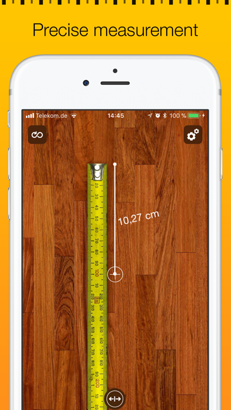

<!-- PROJECT LOGO -->
 

   
  <h2 align="center">AR Ruler</h2>

AR Ruler app uses augmented reality technology (AR) to tape measure the real world with your smartphone’s camera.

 

### Technologies Used

`Swift 5`  `ARKit`  `SceneKit`
